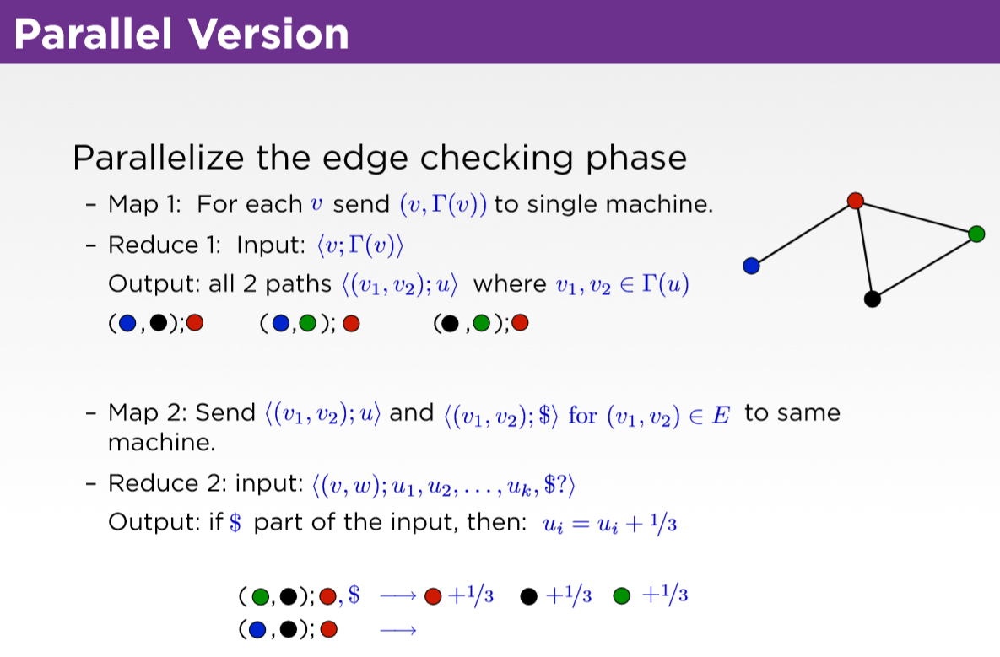

# Naive algorithm



- cc(Blue) = N/A
- cc(Red) = 1/3
- cc(Green) = 1
- cc(Black) = 1

## Data structure
### Raw data
数字表示结点，一对数字，表示这两个节点之间有一条边。

## 用OOD其实不高效

## Mapper 0
- emit(<Red, Blue>)
- emit(<Red, Black>)
- emit(<Red, Green>)
- emit(<Blue, Red>)
- emit(<Black, Red>)
- emit(<Black, Green>)
- emit(<Green, Red>)
- emit(<Green, Black>)

## Reducer 0
- Input
    1. <Red, [Blue, Black, Green]>
    2. <Blue, [Red]>
    3. <Black, [Red, Green]>
    4. <Green, [Red, Black]>
- Output
    1. <(actual edge), "$">         
    2. <(possible edge), vertex>    // nested loop

## Mapper 1
- Input
    - 0,1     $
    - 1,3     $
    - 1,2     $
    - 1,0     $
    - 3,2     1
    - 3,0     1
    - 2,0     1
    - 2,3     $
    - 2,1     $
    - 3,1     2
    - 3,2     $
    - 3,1     $
    - 2,1     3

```
    if input type is <(v1, v2), vertex>:
        if (v1, v2) is actual edge:
            emit(<vertex, 1>)
```

## Reducer 1
- Worker1(<Red, [Blue, Black, Green]>): 
    1. emit(<(Blue, Black), Red>)
    2. emit(<(Blue, Green), Red>)
    3. emit(<(Black, Green), Red>)

- Worker2(<Blue, [Red]>):
    emit nothing

- Worker3(<Black, [Red, Green]>):
    1. emit(<(Red, Green), Black>)

- Worker4(<Green, [Red, Black]>):
    1. emit(<(Red, Black), Green>)

## Mapper 2
- Worker1(<(Blue, Black), Red>):
    - (Blue, Black) is not an edge -> emit(<(Blue, Black), Red>)

- Worker2(<(Blue, Green), Red>):
    - (Blue, Green) is not an edge -> emit(<(Blue, Green), Red>)

- Worker3(<(Black, Green), Red>):
    - (Black, Green) is an edge -> emit(<(Black, Green), Red, $>)

- Worker4(<(Red, Green), Black>):
    - (Red, Green) is an edge -> emit(<(Red, Green), Black, $>)

- Worker5(<(Red, Black), Green>):
    - (Red, Black) is an edge -> emit(<(Red, Black), Green, $>)

## Reducer2
- Worker1


- Worker3(<(Black, Green), Red, $>):
    emit(Red, 1)

- Worker4(<(Red, Green), Black, $>):
    emit(Black, 1)

- Worker5(<(Red, Black), Green, $>):
    emit(Green, 1)

## Result


