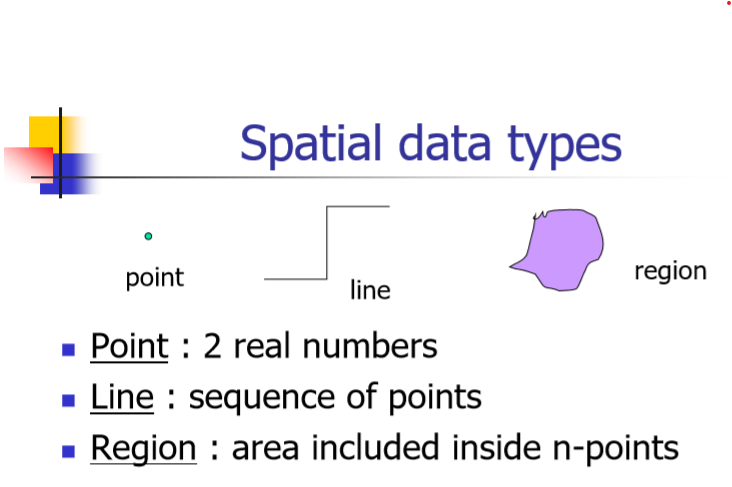

# CS 562 Advanced Database Applications
20 Spring

George Killios, Boston University
# Introduction
## IO complexity

# B Tree and B+ Tree

# External Memory Hashing

## Linear Hashing

## Extensible Hashing

# Spatial Database

## Access Methods
PAM only index point data.
SAM index both points and regions.
### Point Access Methods (PAMs)
- K-D Tree
- Z-Ordering | Hilbert-Ordering
- Grid File

### Spatial Access Methods (SAMs)
- R Tree
    - Point query;
    - Range query;
    - K-NN query. (Best Fit Algorithm)

## Point Access Methods (PAM)
### Grid File

### kd-tree
### Z-ordering
### Hilbert Curve

# Temporal Database
Deletion is logical (never physical deletions!) 

## Taxonomy of time
### Transaction time database
### Valid time database
### Bi-temporal database

## Snapshot Index
### Access forest

## MVBT Multi-version B Tree

# Spatio-Temporal-Database

# Time Parameterized Queries

# Indexing Time Series Data
## GEMINI
## Fourier Transform
## Wavelet Transform

## DTW
## Edit Distance
## LCSS
